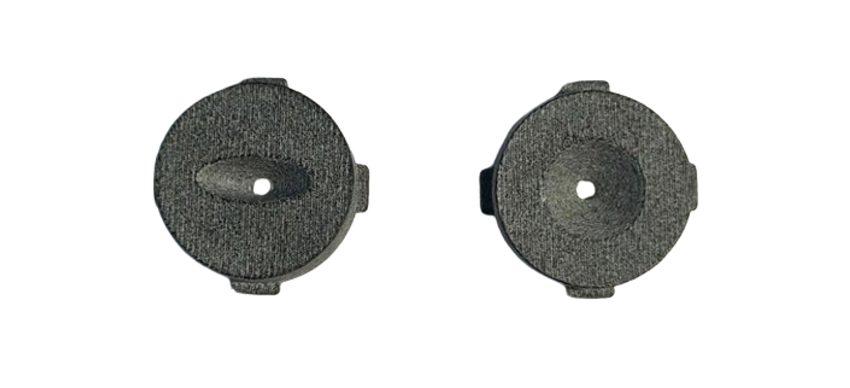

<!--
*** Template source: https://github.com/othneildrew/Best-README-Template/blob/master/README.md
-->

<!-- PROJECT SHIELDS -->
<!--
*** I'm using markdown "reference style" links for readability.
*** Reference links are enclosed in brackets [ ] instead of parentheses ( ).
*** See the bottom of this document for the declaration of the reference variables
*** for contributors-url, forks-url, etc. This is an optional, concise syntax you may use.
*** https://www.markdownguide.org/basic-syntax/#reference-style-links
-->
<!-- [![Contributors][contributors-shield]][contributors-url] -->
<!-- [![Forks][forks-shield]][forks-url] -->
<!-- [![Stargazers][stars-shield]][stars-url] -->
<!-- [![Issues][issues-shield]][issues-url] -->
<!-- [![License][license-shield]][license-url] -->


<!-- PROJECT LOGO -->
<div align="center">
  <a href="pics/drone.png">
    
  <!--</a>-->

  <h3>ToF_US_Obstacle_Avoidance</h3>

  <p>
    Indoor Navigation System Based on Multi-Pixel Time-of-Flight and Ultrasound Sensor for Nano-Drone Applications
    <br />
    <a href="https://git.ee.ethz.ch/pbl/FS2024/laurent_schroeder_392/-/tree/main"><strong>Explore the docs »</strong></a>
    <br />
    <br />
    <!--<a href="https://youtu.be/FyipTqjBGuM">View Demo</a>-->
    ·
    <a href="https://git.ee.ethz.ch/pbl/FS2024/laurent_schroeder_392/-/issues">Report Bug</a>
    ·
    <a href="https://git.ee.ethz.ch/pbl/FS2024/laurent_schroeder_392/-/issues">Request Feature</a>
  </p>
</div>


<!-- TABLE OF CONTENTS -->
## Table of Contents

* [About the Project](#about-the-project)
* [Hardware](#hardware)
  * [VL53L5CX Sensor](#vl53l5cx-sensor)
  * [ICU-30201 Sensor](#icu-30201-sensor)
* [Getting Started](#getting-started)
  * [Software](#software)
* [Measurements](#measurements)
  * [Read Data](#read-data)
  * [Plot Data](#plot-data)
  


<!-- ABOUT THE PROJECT -->
## About The Project

Unmanned aerial vehicles (UAVs) have recently attracted the industry's attention due to their potential use in critical applications like rescue missions and a wide range of civilian and commercial purposes.
A promising UAV sub-class includes nano UAVs, which are characterized by their small size and extremely limited on-board computational resources.
These features present significant challenges for enabling autonomous navigation or even basic sub-tasks like reliable obstacle avoidance. This project employs the sensor fusion strategy by integrating a multizone Time of Flight (ToF) and an ultrasonic sensor to enable autonomous navigation and obstacle avoidance with a lower computational load compared to most common visual-based solutions. 

<!-- ### Videos and Demos
* [PBL Event: catch me if you can][video1_url]
* [Towards Reliable Obstacle Avoidance for Nano-UAVs][video2_url]
* [Enabling Obstacle Avoidance for Nano-UAVs with a multi-zone depth sensor and a model-free policy][video3_url] -->


## Hardware

This project utilized the open-source [Crazyflie 2.1][crazyflie_url] from Bitcraze and expanded its functionality by integrating both the <a href="https://www.cdiweb.com/products/detail/evmodicu3020100-tdk-invensense/781499/">ICU-30201</a> sensor from TDK introduced in the [BatDeck][batdeck_url] paper and the <a href="https://www.st.com/resource/en/datasheet/vl53l5cx.pdf">VL53L5CX</a> sensor from STMicroelectronics introduced in the [Robust and Efficient Depth-Based Obstacle Avoidance for Autonomous Miniaturized UAVs][tof_paper_url] paper onto the platform. Hereafter, we provide details regarding the <a href="https://www.st.com/resource/en/datasheet/vl53l5cx.pdf">VL53L5CX</a> and the <a href="https://www.cdiweb.com/products/detail/evmodicu3020100-tdk-invensense/781499/">ICU-30201</a> sensor.

### VL53L5CX Sensor
The <a href="https://www.st.com/resource/en/datasheet/vl53l5cx.pdf">VL53L5CX</a> is a ToF multizone ranging sensor produced by STMicroelectronics. 
It is based on a vertical-cavity surface-emitting laser (VCSEL), a single-photon avalanche detector (SPAD) array, physical infrared filters, and diffractive optical elements (DOE). The <a href="https://www.st.com/resource/en/datasheet/vl53l5cx.pdf">VL53L5CX</a> sensor can provide either a 4x4 or a 8x8 pixels matrix, which is configurable by software. The working range spans between 2 cm and 4 m with an accuracy of 15 mm in absolute value from 2 cm to 2 m and above the accuracy decreases up to 11% of the absolute distance. Moreover, the ToF sensor offers two configurable ranging modes with varying resolutions, ranging frequencies, and integration times: continuous or autonomous ranging. In autonomous ranging, the VCSEL is deactivated when not in use by adjusting the integration time to conserve energy. For our purposes, we utilize the continuous mode, where the VCSEL remains active continuously, allowing for maximum integration time. Both modes support resolutions of either 4x4 pixels, operating at a maximum frequency of 60 Hz, or 8x8 pixels, as employed in this study, with a maximum frequency of 15 Hz and a wide 65&deg; diagonal FoV, which can be reduced by software.

<div align="center">
<a href="pics/VL53L5CX%20sensor.png">
    
    <capfigure>VL53L5CX sensor</capfigure>
</a>
</div>

<!-- It integrates a single-photon avalanche diode (SPAD) array, physical infrared filters, and diffractive optical elements (DOE) to achieve a millimeter accuracy in various ambient lighting conditions with a wide range of cover glass materials. The working range spans between 2 cm and 4 meters, but above 2 m, the overall ranging precision degrades to 11% of the absolute distance. The most important feature of the VL53L5CX is the multizone capability, which can be configured as an 8x8 or 4x4 matrix. 
Listed below is the list of key components for our integrated deck targetted for the Crazyflie 2.1 platform: 


The VL53L5CX 1 sensor is a SoA, ToF sensor that has been designed to achieve the best ranging performance in various ambient lightning and temperature conditions, based on a Vertical-Cavity Surface-Emitting Laser (VCSEL), a Single-Photon Avalanche Detector (SPAD) array, physical infrared filters, and Diffractive Optical Elements (DOE). The VL53L5CX sensor can provide either a 4x4 or a 8x8 pixels matrix, which is configurable by software. Each of the 64 zones provides a distance measurement to the closest object in that particular zone and in case the measurement was unsuccessful due to misscalcu- lation or interference, an error flag gets set for that pixel [1]. In that way, by overlapping the validity matrix over the distance matrix, I can filter out wrong or noisy measure- ments. The sensor itself has dimensions of 6.4 x 3.0 x 1.5 mm and is characterized by STMicroelectronics on having an accuracy of 15 mm in absolute value from 2 cm to 2 m and above the accuracy decreases up to 11% of the absolute distance, working until 4 m 1.
The ToF sensor offers two configurable ranging modes with varying resolutions, ranging frequencies, and integration times: continuous or autonomous ranging. In autonomous ranging, the VCSEL is deactivated when not in use by adjusting the integration time to conserve energy. For my purposes, I utilize the continuous mode, where the VCSEL remains active continuously, allowing for maximum integration time. Both modes support resolutions of either 4x4 pixels, operating at a maximum frequency of 60 Hz, or 8x8 pixels, as employed in this study, with a maximum frequency of 15 Hz and a wide 65◦ diagonal FoV, which can be reduced by software. -->


<!-- * [VL53L5CX][VL53L5CX_url],       ToF multizone ranging sensor
* [TPS62233][tps62233_url],       3-MHz Ultra Small Step-Down Converter
* [TCA6408A][tca6408a_url],       Low-Voltage 8-Bit I2C and SMBus I/O Expander -->

### ICU-30201 Sensor
The TDK <a href="https://www.cdiweb.com/products/detail/evmodicu3020100-tdk-invensense/781499/">ICU-30201</a> sensor is a ultra-low power ultrasonic transceiver rangefinder utilizing a piezoelectric micromachined ultrasonic transducer (PMUT), operating at a frequency of f<sub>op</sub> = 50 kHz. It emits short pulses of sound waves into the air, which subsequently hit an object and are reflected. By measuring the ToF of these sound waves and utilizing the known sound velocity in air (343 m/s at room temperature), the system can accurately determine the distance to the object. Furthermore, the sensor is equipped with a 40 MHz CPU for sampling and preprocessing, capable of handling a maximum of 340 samples per measurement. These data samples can be stored either as In-phase and Quadrature (IQ) components or as phase and magnitude. In our project, we only use the magnitude of the samples. Additionally, the output data rate (ODR) is configurable and can be set to the following values: ODR = f<sub>op</sub>/N with N = 2, 4, 8.

<div align="center">
<a href="pics/ICU-30201_sensor.png">
    
    <capfigure>ICU-30201 Sensor</capfigure>
</a>
</div>


<!-- <style>
    .container {
        display: flex;
        justify-content: space-between;
        align-items: center;
    }
    .figure {
        margin: 0 10px;
        text-align: center;
    }
    .figure img {
        max-width: 100%;
        height: auto;
    }
</style>


<div class="container">
    <figure class="figure">
        
        <figcaption>Caption for image 1</figcaption>
    </figure>
    <figure class="figure">
        
        <figcaption>Caption for image 2</figcaption>
    </figure>
</div> -->


<!-- <div align="center">
<a href="https://git.ee.ethz.ch/pbl/FS2024/laurent_schroeder_392/-/blob/main/pics/VL53L5CX%20sensor.png">
    
</a>
</div>-->


<!-- ### PCB 
The matrix ToF printed circuit board (PCB) is built of 2 Layers with a total board thickness of only 0.43mm. Further information about the PCB can be found here:

File                                  | Content
--------------------------------------|--------
[Deck_schematics.pdf]                 | Schematics of the deck that supports 2 VL53L5CX.  
[Deck_PCB_3D.pdf]                     | Layout 3D view with details of components and nets.
[Deck_BOM.xlsx]			      | Bill of material for the Deck PCB.
[Sensor_Board_schematics.pdf]         | Schematic of the lateral PCB that holds one VL53L5CX.
[Sensor_Board_PCB_3D.pdf]             | Layout 3D view with details of components and nets.
[Sensor_Board_BOM.xlsx]               | Bill of material for the sensor board.
[Final_Assembly_3D.pdf]               | Assembly of one Deck PCB with two sensor board PCBs, front-facing and back-facing directions. 


The preview of the assembly, with details of logical connections, can be found here:

<p align="center">
<a href="https://github.com/ETH-PBL/Matrix_ToF_Drones/Hardware/TofDeck/Deck_3D.pdf">
    
</a>
</p>

## Dataset

Tests were performed in controlled and open spaces, with the support of a motion capture system (mocap) Vicon Vero 2.2 at a rate of 50 Hz. A human pilot manually steered the Crazyflie. Initially, the dataset was used to develop and test the obstacle avoidance algorithm. However, other researchers can also use it to improve our system by integrating the multi-zone ToF data with processed information from a CNN and the grayscale camera or by applying a more general DNN algorithm to enhance on-board intelligence. 
We collected (a) internal state estimation (attitude, velocity, position) of the Crazyflie, (b) multi-zone ToF array in 8x8 pixel configuration, (c) camera images (QVGA greyscale), (d) Vicon data (attitude, position) in a time series format with millisecond accuracy. The dataset consists of three main groups: object approach moving the drone on a single axis, yaw rotations around the Z-axis, and a general-purpose set of flying tests approaching various obstacles and narrow holes. The first group, named Linear Movements, consists of 10 recordings of flights with (a), (b), (c), and (d) data, approaching a wood panel at different speeds and stopping and flying back always on the same axis, rotations and altitude variations are disabled. The total test time is 216 seconds with an average of 22 seconds per acquisition. The next group, Yaw Rotations, consists of 3 recordings with (a), (b), (c), and (d) data, rotating on a single axis (yaw) at 1 meter from an obstacle. Recorded data reach a total of 94 seconds. The third and final group, named Obstacle Avoidance, is composed of 30 recordings with a mixed combination of (a), (b), (c), (d) - 14 acquisitions - and (a), (b), (c) - 16 acquisitions. In total, for the third group, 17 minutes of flight maneuvers are present in the Flight DataSet folder, with an average of 35 seconds per acquisition. 

The list of experiments is available here: [Flight_description.xlsx]

### Dataset Visualizer

A Conda virtual environment is provided to execute the <a href="https://github.com/ETH-PBL/Matrix_ToF_Drones/blob/main/Flight%20DataSet/Flight_visualizer.py">Flight_visualizer.py</a> script, an example of the exported video is provided below. The <a href="https://github.com/ETH-PBL/Matrix_ToF_Drones/blob/main/Flight%20DataSet/Flight_visualizer.py">Flight_visualizer.py</a> also emulate the control policy of the Crazyflie 2.1 providing the decision taken based on the input pair from the balck and white camera and the ToF sensor. Note that there are slight differences in the python and c code results - the python code does not implement a take-off phase, so the decisions while taking off do not reflect the drone's behavior (the drone first takes off to the set target height no matter the environment, as it can not fly extremely close to the ground).

```
conda env create -f environment.yml
```

then activate the environment using

```
conda activate Matrix_ToF_Drones
```

then run 

```
python Flight_visualizer.py
```

The generated videos will be saved to the folder VisualizerResults in the following format:

<p align="center">
<a href="https://github.com/ETH-PBL/Matrix_ToF_Drones">
    
</a>
</p>

NOTE: The <a href="https://github.com/ETH-PBL/Matrix_ToF_Drones/blob/main/Flight%20DataSet/Flight_visualizer.py">Flight_visualizer.py</a> will export by default all the experiments from the selected folder, resulted videos will be saved to a different folder. The default settings for the source and destination folders are as below:

```
folder_address = "Approach/"
```
```
address2save = "VisualizerResults/"
``` -->

## Getting Started

#### Material

* The [Crazyflie 2.1][crazyflie_url]
* The [Flow Deck v2][flowdeck_url]. The VL53L1x ToF sensor measures the distance to the ground with high precision and the PMW3901 optical flow sensor measures movements of the ground.
* The forward pointing [VL53L5CX][VL53L5CX_url] sensor with its corresponding expansion deck
* The forward facing [ICU-30201][icu-30201_url] sensor with its corresponding expansion deck 
* The final setup can be seen in the [final_setup.png][Final_setup] picture

#### Software

* [Crazyflie Client][cfclient_url]

### Building and Flashing

This work was tested using the [Crazyflie Firmware][cffw_url] with the commit b15eebc864e7e734daa3766d116fa26edbc940a9, but be sure to replace the crazyflie-firmware/src/modules/interface/mem.h file with the <a href="https://git.ee.ethz.ch/pbl/FS2024/laurent_schroeder_392/-/blob/main/Firmware/crazyflie-firmware-directory/mem.h?ref_type=heads">mem.h</a> file in the <a href="https://git.ee.ethz.ch/pbl/FS2024/laurent_schroeder_392/-/tree/main/Firmware/crazyflie-firmware-directory?ref_type=heads">Firmware/crazyflie-firmware-directory</a> directory and delete this directory afterwards (you don't need it anymore). <a href="https://git.ee.ethz.ch/pbl/FS2024/laurent_schroeder_392/-/tags/Bachelor_Thesis_tag">This</a> is the code that was used for the report and the presentation in the Bachelor_Thesis folder.
<!-- The code that was used for the report in the Bachelor_Thesis folder is found  paper titled "Robust and Efficient Depth-based Obstacle Avoidance for Autonomous Miniaturized UAVs" is found at the GitHub <a href="https://github.com/ETH-PBL/Matrix_ToF_Drones/releases/tag/v1.0">tag v1.0</a> in this repository. However, since then, the build system of the Crazyflie firmware has been updated, so to make this code compatible with newer versions the newest code in this git repo is updated to the kbuild system. -->

- Follow the [Crazyflie guide][cfbf_url] for building and flashing, and make sure you can compile the crazyflie-firmware without any issues
- Clone this repository and update ```CRAZYFLIE_BASE``` in the **Makefile** (in the Firmware directory) to point to your own crazyflie-firmare repository
- Open a terminal inside the Firmware folder
- Put your drone in bootloader mode
- Execute the following commands:

```
make clean
make 
make cload
```

### Take-off!

- Turn on the drone  
- Connect to it via [Crazyflie Client][cfclient_url]
- Optional: Adapt params like max vel, height, etc. if wanted (in the Parameters tab, ToF_FLY_PARAMS)
- Optional: Adapt params of the sensor fusion function if wanted (in the Parameters tab, SENS_FUS_Func)
- Enter a number (in seconds) for how long it should fly (it will anyway land once the battery runs out) in the ToFly parameter (in the Parameters tab, ToF_FLY_PARAMS)
- Press enter, it will take off and start flying around!
- Optional: Look at the cmds in the Plotter tab (add a config under "Settings" "logging configurations")


## Measurements
<!-- Measurements are important to characterize the funct -->
<div align="center">
<figure>
<a href="pics/Horizontal_Cricular_Horn.png">
    
    <figcaption>Horizontal Horn on the left and Circular Horn on the right</figcaption>
</a>
</figure>
</div>

In order to decide between the circular horn and the horizontal horn for the ICU-30201 sensor, we always took two different measurements in the Measurements folder for both the Circular_FoV and the Horizontal_FoV:
* Distance measurement with a wall in front of the drone at a certain distance in the Distance_Measurement folder
* Angle measurement at which the sensor still recognizes the wall 1.5 m horizontally away from the drone in the Angle_Measurement_150cm_away folder

<div align="center">
<figure>
<a href="pics/Measurement_setups.png">
    
</a>
</figure>
</div>

Based on those measurements, we chose the circular horn. Then we also determined the maximum angle of approach at which the ICU-30201 is capable of recognizing a glass obstacle 1 m away from the drone and stored the results in the Measurements/Circular_FoV/Ultrasound_Angle_Detection_Glas_1m_away folder. The setup can be seen in the following picture:

<div align="center">
<figure>
<a href="pics/Ultrasound_Angle_Detection_Glas_1m_away_setup.png">
    
</a>
</figure>
</div>


### Read Data
In order to read data with the ICU-30201 sensor while the drone is flying, execute the following steps after building and flashing the code to the drone:

- Turn on the drone  
- Open a terminal in the Measurements folder
- Execute the following command: 

```
python3.11 read-icu30201.py -l test_us.csv -lcf test_cf.csv -t 1
```

This will store the logged data in the test_cf.csv file and the detected amplitude values in the test_us.csv file

### Plot Data
After reading the data, you can visualize it by plotting it with the following command:

- Open a terminal in the Measurements folder
- Execute the following command: 

```
python3.11 plot-icu30201.py -l test_us.csv
```

If you stored the test_us.csv file in another folder, replace test_us.csv with the correct path to the file


<!-- ## Acknowledges

If you use **Matrix ToF Drone** in an academic or industrial context, please cite the following publications:

~~~~
@article{muller2023robust,
  title={Robust and efficient depth-based obstacle avoidance for autonomous miniaturized uavs},
  author={M{\"u}ller, Hanna and Niculescu, Vlad and Polonelli, Tommaso and Magno, Michele and Benini, Luca},
  journal={IEEE Transactions on Robotics},
  year={2023},
  publisher={IEEE}
}
~~~~
~~~~
@INPROCEEDINGS{20.500.11850/476189,
	copyright = {Creative Commons Attribution 4.0 International},
	year = {2022},
	author = {Niculescu Vlad, Müller Hanna, Ostovar Iman, Polonelli Tommaso, Magno Michele, Benini Luca},
	keywords = {UAV, nano-drone, autonomous navigation, obstacle avoidance, Time of Flight},
	language = {en},
	title = {Towards a Multi-Pixel Time-of-Flight Indoor Navigation System for Nano-Drone Applications.},
}
~~~~

~~~~
@inproceedings{ostovar2022demo,
  title={Demo Abstract: Towards Reliable Obstacle Avoidance for Nano-UAVs},
  author={Ostovar, Iman and Niculescu, Vlad and M{\"u}ller, Hanna and Polonelli, Tommaso and Magno, Michele and Benini, Luca},
  booktitle={2022 21st ACM/IEEE International Conference on Information Processing in Sensor Networks (IPSN)},
  pages={501--502},
  year={2022},
  organization={IEEE}
}
~~~~ -->


<!-- MARKDOWN LINKS & IMAGES -->
<!-- https://www.markdownguide.org/basic-syntax/#reference-style-links -->

<!--Subsection Hardware-->
[VL53L5CX_url]:     https://www.st.com/resource/en/datasheet/vl53l5cx.pdf
[crazyflie_url]:    https://www.bitcraze.io/products/crazyflie-2-1/
[flowdeck_url]:     https://store.bitcraze.io/collections/decks/products/flow-deck-v2
[batdeck_url]:      https://arxiv.org/abs/2403.16696
[tof_paper_url]:    https://ieeexplore.ieee.org/document/10272390/references#references
[icu-30201_url]:    https://www.cdiweb.com/products/detail/evmodicu3020100-tdk-invensense/781499/

<!-- Subsection Getting Started -->
[Final_setup]:       /pics/drone.png


[cfclient_url]:	                        https://www.bitcraze.io/documentation/repository/crazyflie-clients-python/master/
[cffw_url]:	                            https://github.com/bitcraze/crazyflie-firmware
[cfbf_url]:	                            https://www.bitcraze.io/documentation/repository/crazyflie-firmware/master/building-and-flashing/build/


<!-- [contributors-shield]: https://img.shields.io/github/contributors/ETH-PBL/Matrix_ToF_Drones.svg?style=flat-square -->
<!-- [contributors-url]: https://github.com/ETH-PBL/Matrix_ToF_Drones/graphs/contributors -->
<!-- [forks-shield]: https://img.shields.io/github/forks/ETH-PBL/Matrix_ToF_Drones.svg?style=flat-square -->
<!-- [forks-url]: https://github.com/ETH-PBL/Matrix_ToF_Drones/network/members -->
<!-- [stars-shield]: https://img.shields.io/github/stars/ETH-PBL/Matrix_ToF_Drones.svg?style=flat-square -->
<!-- [stars-url]: https://github.com/ETH-PBL/Matrix_ToF_Drones/stargazers -->
<!-- [issues-shield]: https://img.shields.io/github/issues/ETH-PBL/Matrix_ToF_Drones.svg?style=flat-square -->
<!-- [license-shield]: https://img.shields.io/github/license/ETH-PBL/Matrix_ToF_Drones.svg?style=flat-square -->
<!-- [license-url]: https://github.com/ETH-PBL/Matrix_ToF_Drones/blob/master/LICENSE -->
[product-screenshot]: pics/drone.png
<!-- [issues-url]: https://git.ee.ethz.ch/pbl/FS2024/laurent_schroeder_392/-/issues -->
